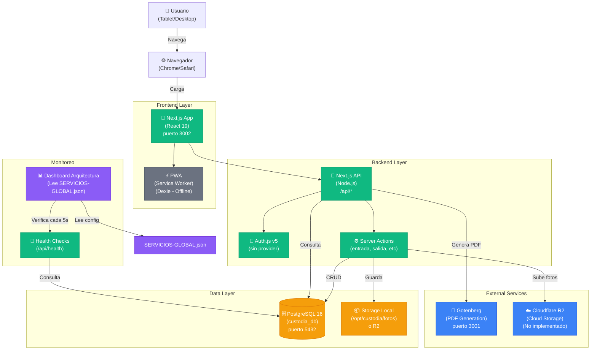
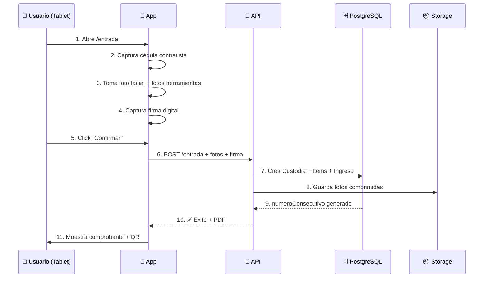
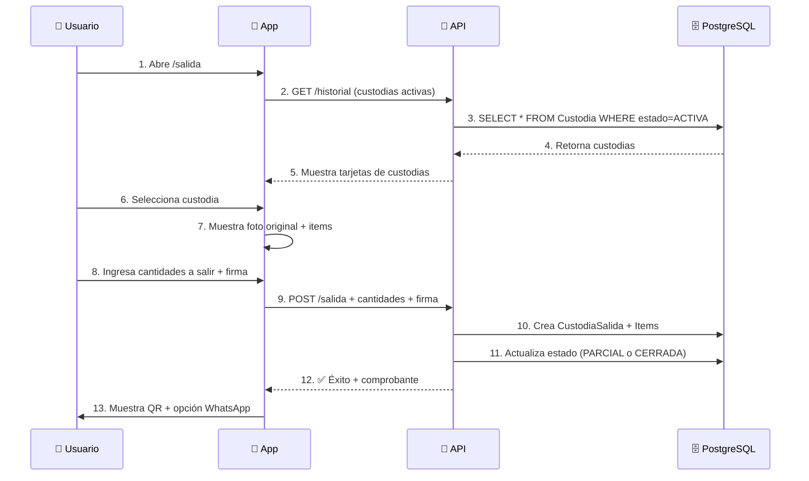
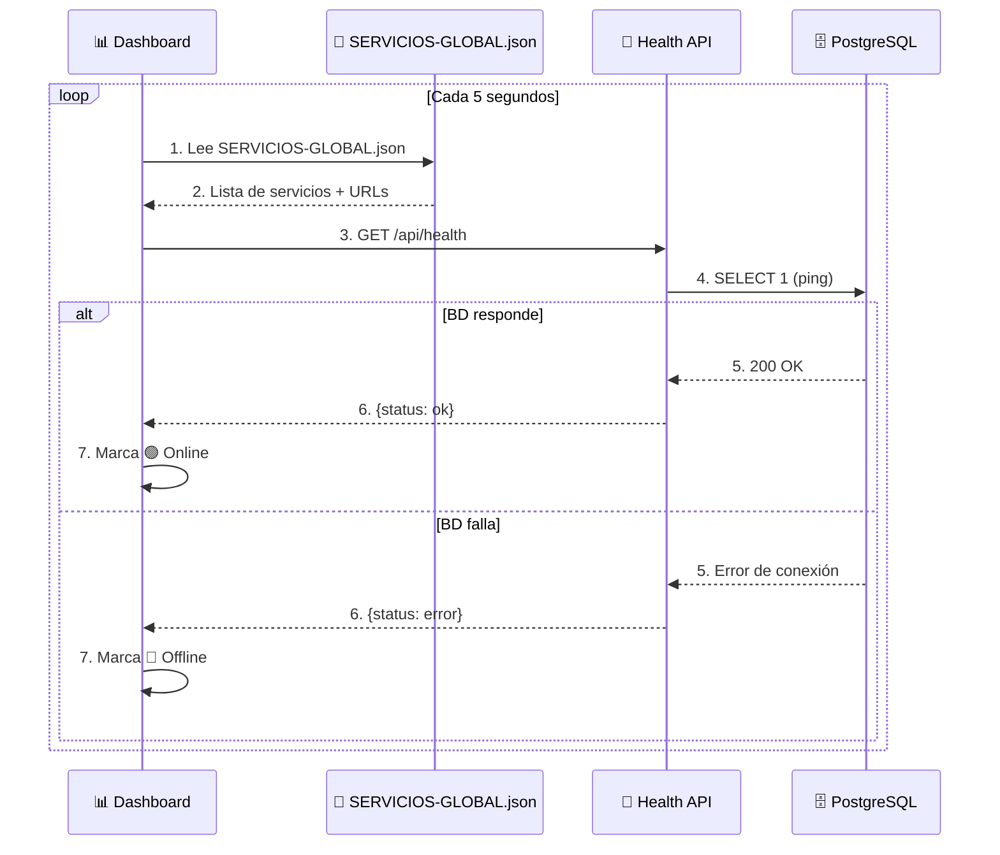
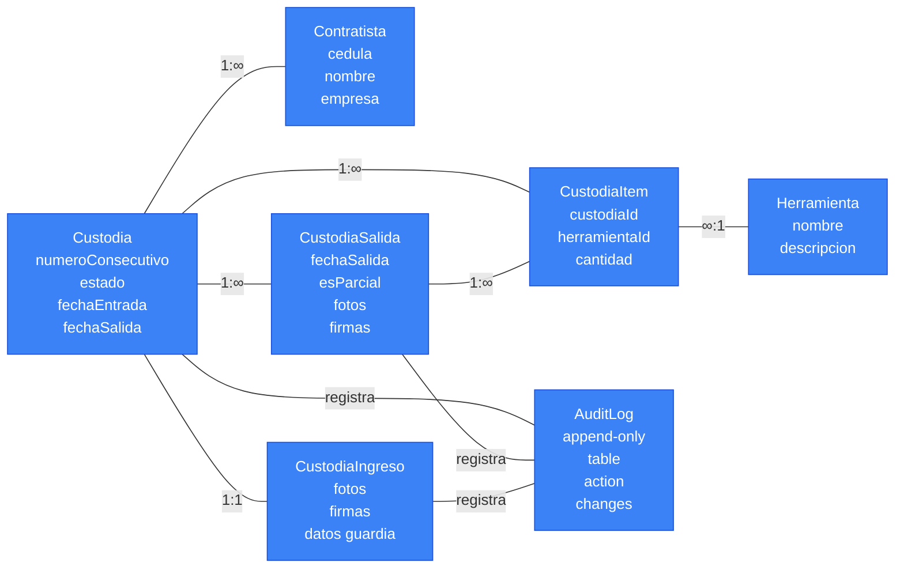

# 🏗️ ARQUITECTURA - Custodia de Herramientas

**Versión:** 1.0.0  
**Última actualización:** 2026-09-12  
**Ambiente:** Desarrollo & Producción  
**Región:** Zona Franca Barranquilla

---

## 📊 DIAGRAMA DE ARQUITECTURA (Tiempo Real)



---

## 🔄 FLUJOS PRINCIPALES

### Flujo 1: ENTRADA DE HERRAMIENTAS


### Flujo 2: SALIDA DE HERRAMIENTAS


### Flujo 3: MONITOREO EN TIEMPO REAL


---

## 📋 SERVICIOS Y SU ESTADO

### Estado Actual (Dev)

| Servicio | Host | Puerto | Estado | Crítico |
|---|---|---|---|---|
| **Next.js App** | localhost | 3002 | 🟢 Desarrollo | ✅ Sí |
| **PostgreSQL** | localhost | 5432 | 🟢 Corriendo | ✅ Sí |
| **Gotenberg** | localhost | 3001 | 🟢 Corriendo | ❌ No |
| **Cloudflare R2** | cloud | - | ⚪ Deshabilitado | ❌ No |
| **Keycloak** | - | - | ⚫ No implementado | ❌ No |

### Puertos en Desarrollo
```
3002 → Next.js App (desarrollo)
3001 → Gotenberg (PDF)
5432 → PostgreSQL
```

### Puertos en Producción (srv-lab)
```
3010 → Next.js App (custodia)
3011 → Mantenimiento (futuro)
3012 → Reportes (futuro)
5432 → PostgreSQL (compartida)
8080 → Keycloak (futuro, realm: zfb)
```

---

## 🔐 SEGURIDAD Y PERMISOS

### Matriz de Roles

| Acción | admin | usuario | lector |
|---|---|---|---|
| Registrar entrada | ✅ | ✅ | ❌ |
| Registrar salida | ✅ | ✅ | ❌ |
| Ver reportes | ✅ | ✅ | ✅ |
| Ver historial | ✅ | ✅ | ✅ |
| Gestionar usuarios | ✅ | ❌ | ❌ |
| Gestionar herramientas | ✅ | ❌ | ❌ |
| Ver auditoría | ✅ | ❌ | ❌ |

### Autenticación Futura (Keycloak)
```yaml
Realm: zfb
Clientes:
  - custodia-herramientas (actual)
  - app-mantenimiento (futura)
  - reportes (futura)

Roles:
  - custodia_admin / custodia_usuario / custodia_lector
  - mantenimiento_supervisor / mantenimiento_tecnico / mantenimiento_lector
  - reportes_lector
```

---

## 💾 BASE DE DATOS

### Tablas Principales



---

## 🚀 DEPLOYMENT

### Desarrollo Local
```bash
docker-compose up -d postgres gotenberg
npm install
npm run db:migrate:dev
npm run dev
# App en http://localhost:3002
```

### Producción (srv-lab)
```bash
# Servidor: 10.1.9.250
# Servicios: Docker + Traefik
# BD: PostgreSQL 16 compartida
# Puerto: 3010 (custodia)
```

---

## 📈 MONITOREO

### Health Checks Automáticos
```bash
# Verificación cada 5 segundos
GET http://localhost:3002/api/health

# Respuesta OK:
{
  "status": "ok",
  "timestamp": "2026-09-12T10:00:00Z"
}

# Respuesta Error:
{
  "status": "error",
  "message": "Database connection failed"
}
```

### Dashboard
- Se ejecuta en `/dashboard` (próximamente)
- Lee `SERVICIOS-GLOBAL.json`
- Muestra estado en tiempo real
- Verifica cada 5 segundos

---

## 📞 ESCALABILIDAD FUTURA

### Próximas Aplicaciones
1. **Mantenimiento** (puerto 3011)
   - Dependencias: PostgreSQL, Keycloak
   - BD separada: mantenimiento_db

2. **Reportes** (puerto 3012)
   - Dashboard centralizado
   - Dependencias: PostgreSQL, Keycloak
   - BD: reportes_db

3. **Keycloak Centralizado**
   - Realm: zfb
   - Múltiples clientes
   - SSO entre apps

---

## 🔗 DEPENDENCIAS EXTERNAS

### Implementadas
- ✅ PostgreSQL 16
- ✅ Gotenberg 8
- ✅ Next.js 15
- ✅ Prisma 6.19

### Planeadas (FASE 2)
- ⏳ Keycloak (realm: zfb)
- ⏳ Cloudflare R2 (storage)
- ⏳ Gotenberg + PDF signing

### Opcionales
- ❓ Redis (caché)
- ❓ Elasticsearch (búsqueda)
- ❓ Grafana + Prometheus (monitoreo avanzado)

---

## 📚 DOCUMENTACIÓN RELACIONADA

- [SERVICIOS-GLOBAL.json](./SERVICIOS-GLOBAL.json) - Inventario centralizado
- [INVESTIGACION-COMPLETA.md](./INVESTIGACION-COMPLETA.md) - Análisis exhaustivo
- [CLAUDE.md](./CLAUDE.md) - Instrucciones para desarrollo
- [PWA.md](./PWA.md) - Features offline
- [prisma/README.md](./prisma/README.md) - Documentación BD

---

## 🎯 PRÓXIMOS PASOS

1. ✅ Documentar arquitectura (DONE)
2. ⏳ Crear Dashboard de monitoreo
3. ⏳ Implementar Keycloak
4. ⏳ Agregar app-mantenimiento
5. ⏳ Agregar app-reportes
6. ⏳ Configurar CI/CD

---

**Última actualización:** 2026-09-12 por Claude  
**Contacto:** efrainnunez@gmail.com
